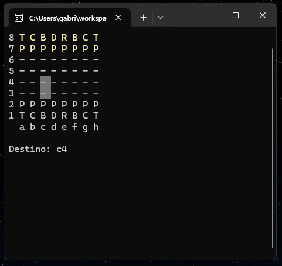
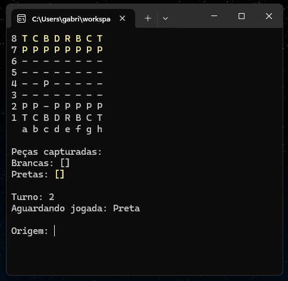
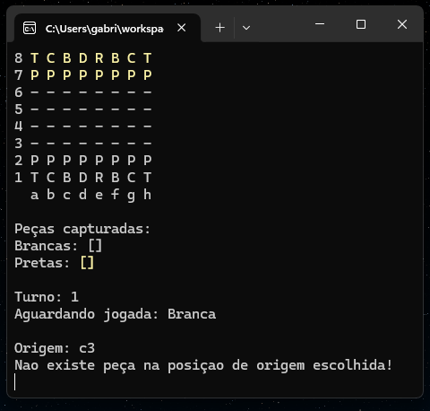

# Jogo de Xadrez no Console

Este é um projeto de um jogo de xadrez desenvolvido para ser executado no console/terminal, focado em utilizar os conceitos de C# e orientação a objetos.

## Funcionalidades

- Jogo de xadrez completo com todas as regras oficiais.
- Interface de usuário no console/terminal.
- Implementação de peças de xadrez com suas respectivas movimentações.
- Verificação de xeque e xeque-mate.

## Tecnologias Utilizadas

- Linguagem: C#
- Paradigma: Orientação a Objetos

## Preview

